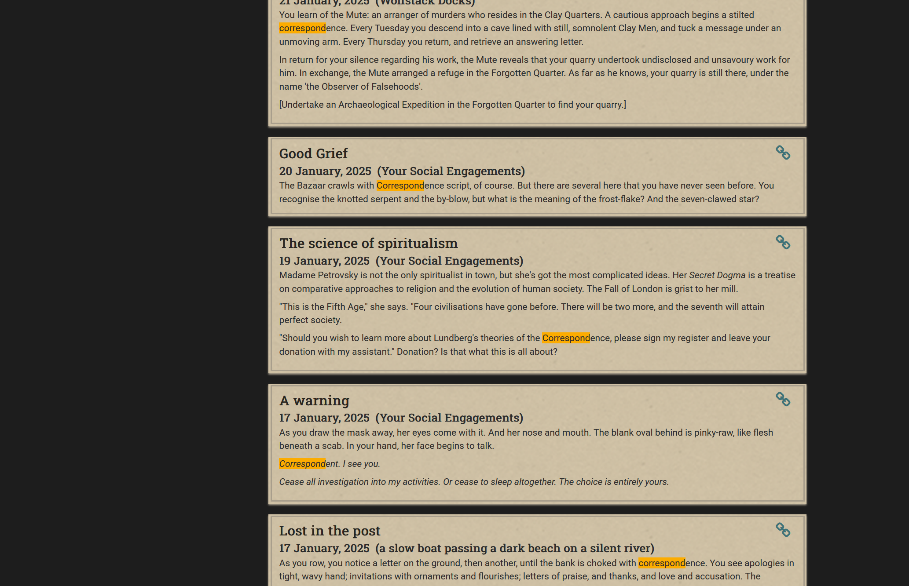

# fl-plugins
Plugins for Fallen London

## [Journal Search](/journal-search)

Allows searching of saved journal entries on user profiles. The search runs a (case-insensitive) match comparison on both the title and entry text.

**Screenshots**

**Notes**
Currently this search may be slow, depending on journal size. It walks through all paged journal API calls and searches each one, resulting in a very long load process at times. It also is not currently paginated, so be cautious when searching terms that may return a vast number of results. This could overload your browser memory.

**Improvements Needed**
* Pagination methodology
* Streamlining of profile entry calls (not sure this is possible, as each call provides the next url within the response!)
